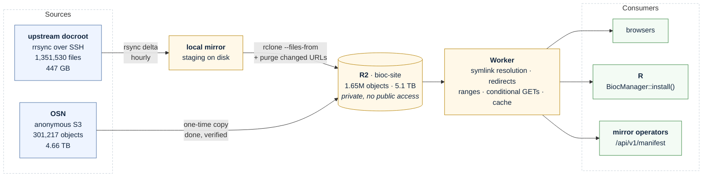
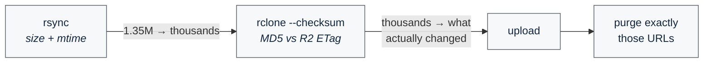
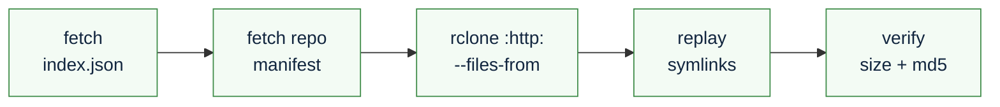

# bioc-cloudflare

Serving `bioconductor.org` from Cloudflare R2 behind a Worker.

-verified-2EA043)

A working prototype at **`bioc-dev.cancerdatasci.org`**. No production traffic.

---

## Why

Bioconductor's origin runs off an EBS volume, and crawlers exhaust its IOPS. The traffic
that hurts is not page views — it is bots pulling hundred-megabyte lecture videos out of
`/help/course-materials/`, where a single directory holds **711 MB of `.mp4` against 2 MB
of HTML**. Roughly 400:1, from two years of materials alone.

Large immutable files behind a CDN with free egress is what object storage is for. Three
things follow:

- **No disk in the serving path.** Object reads at CDN scale are routine for R2 and fatal
  for one EBS volume.
- **Egress is free**, so the videos stop being expensive as well as slow.
- **Freshness comes from purging, not expiry.** The edge holds content for a year and the
  sync purges exactly the keys that changed — so the cache absorbs the long tail instead
  of re-fetching everything every ten minutes.

## What comes from where

The upstream docroot host is reachable only by `rrsync` — no shell, no sftp — so every sync stages
through a local mirror. That constraint is also why the pull computes the delta itself
rather than asking R2 what changed, which at 1.35M objects would mean a `HEAD` per object
on every run.

## How the sync stays cheap

Two filters, because neither alone is right. rsync is cheap but coarse — it flags any file
whose mtime moved, so a rebuild that rewrote identical bytes looks changed. The checksum
pass is precise but only affordable over a short candidate list. Purging off the second
stage rather than the first is what stops a nightly rebuild from purging the whole zone.

## Object storage has no symlinks

The docroot has **145**, and the load-bearing ones are not the obvious ones.
`packages/release` is two of them; roughly 150 are R-version aliases inside `contrib/`
(`.../contrib/4.7 → 4.6`) — how one build serves two R versions, and the path
`install.packages()` actually walks.

They are never uploaded. The sync publishes `_symlinks.json` and the Worker resolves paths
against it per request, so a release roll is **data, not a deploy**. Getting this wrong
fails quietly: every browse URL keeps working while installs break.

## The API

`/api/v1/manifest/` — a published file list, so anyone can mirror with **no credentials**.

| | |
|---|---|
| `GET /api/v1/manifest/index.json` | versions, symlink map, object counts, generated-at |
| `GET /api/v1/manifest/<version>/<repo>.tsv.gz` | `path` · `size` · `md5`, one object per line |

Ten manifests, covering release (3.23) and devel (3.24) across `bioc`, `data/annotation`,
`data/experiment`, `workflows` and `books`.

## Mirroring

No credentials, no S3 tokens, no custom client. Full procedure in **[MIRRORS.md](MIRRORS.md)**.

> [!WARNING]
> `packages/release/` is **not a key in the bucket** — the Worker resolves it per request.
> A sync scoped to that prefix lists zero objects, and with `sync` semantics that
> **deletes an operator's entire existing mirror**. Use the manifest, and `copy` rather
> than `sync`. MIRRORS.md leads with this.

## Status

Measured, not projected.

| | |
|---|---|
| R2 | 1,652,759 objects · 5.1 TB · 0 upload errors |
| Docroot | 1,351,530 files · 447 GB |
| OSN archive | 301,217 objects · 4.66 TB · verified, 0 differences |
| Symlink map | 145 entries |
| `BiocManager::install()` | 8/8 against the mirror |
| Cost | ~$80/month, of which the archive is ~$70 |

## Repo layout

| Path | |
|---|---|
| **[MIGRATION.md](MIGRATION.md)** | The plan, the measurements, and every decision with its reasoning |
| **[MIRRORS.md](MIRRORS.md)** | Runbook for mirror operators |
| `worker/` | The Worker. `node --test worker/test.ts`, no build step |
| `sync.sh` | Mirror → R2 + purge. `RSYNC_SRC=…` for the delta path, `RECONCILE=1` for drift |
| `rsync-filter` | **What the mirror includes.** The scope decision, in one file |
| `finish-load.sh` | Guarded initial load |
| `gen-manifest.sh` | Publishes `/api/v1/manifest/` |
| `cutover-diff.sh` | Diffs bioc-dev against production |
| `test-biocmanager.R` | Acceptance test for the R install path |
| `inventory/` | Snapshots of upstream and R2, plus a DuckDB query layer over both |
| `inventory/db.sh` | One command for reconciliation queries — see `inventory/views.sql` |
| `systemd/` | Sync and reconcile timers, committed but not enabled |

Tests: `./test-itemize.sh`, `./test-cutover-diff.sh`, `node --test worker/test.ts`, and
`cd worker && npm run typecheck`. CI runs all four.

`./test-inventory-views.sh` covers the query layer and is run by hand — it needs `duckdb`,
which is not on the CI runner.

## Not in scope

- **AnnotationHub (10.1 TiB) and ExperimentHub (593 GiB)**, despite sharing the OSN bucket.
  Different service, fetched by their own R packages through a metadata database. See #28.
- **Anything dynamic** — search, BiocViews queries, live build reports.

## Note

This repository is private while findings about the upstream site are still with the
Bioconductor team — see the `upstream` label.

Credentials never live here; `./make-env.sh` pulls them from Secret Manager into a
gitignored `.env`.
